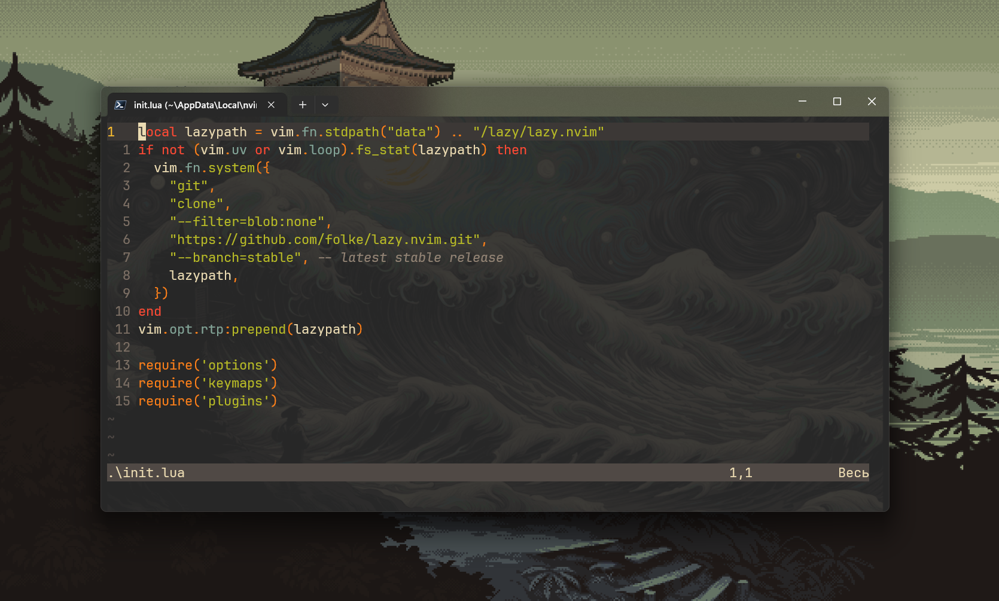

# nvim.
> directory:

```c:\users\{username}\appdata\local\nvim```

> view:



> setup:

```
npm install -g typescript typescript-language-server
npm install -g prettier@latest
npm install -g @typescript-eslint/parser @typescript-eslint/eslint-plugin eslint
```
